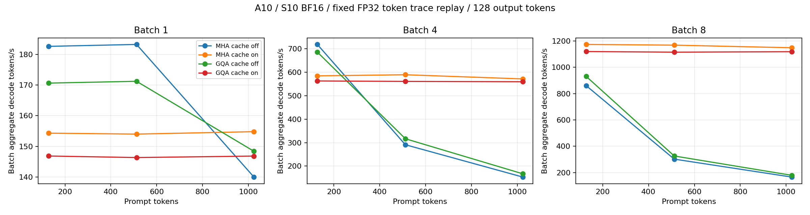
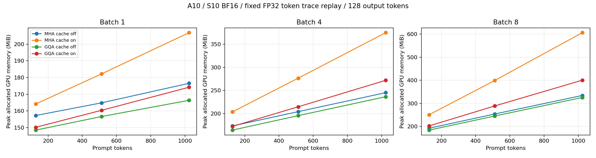

# A10：MiniMind S10 KV Cache / GQA 推理实验

## 结论与验收边界

- 当前 GQA 实现开启缓存的 decode 加速比为 0.82–6.23×；小于 1 的场景是负收益，不能声称缓存总会加速。
- 开启缓存时，GQA 相对等价 MHA 的 decode 加速比为 0.95–0.98×；缓存字节数在所有场景精确减半。
- 以上是 A10 单卡、小模型和当前原生实现的固定轨迹结果，不是模型能力提升。

已完成 36 个主场景及 4 个长生成场景，每场景预热 5 次、正式测量 20 次，共 800 条正式记录。正式运行耗时 1669 秒（27.82 分钟，单卡约 0.464 GPU-hours），包括模型切换与预热。吞吐是整个 batch 的 decode tokens/s，不含 prefill。

FP32 一致性 12/12 通过；BF16 一致性 2/12 通过，未满足预先冻结阈值。BF16 最大绝对误差 0.296875，最大相对 RMSE 1.5599%。阈值未放宽。

4 条真实提示词、每条 32 token 的 BF16 greedy 对照中，8/12 组与 GQA cache-off 完全相同；其余的 token 一致率和首次分歧见 correctness.json。不能声称 BF16 输出严格等价。

因此主测量改为固定 FP32 GQA greedy token 轨迹重放：四臂执行前向和 argmax，但将同一参考 token 送入下一步。数据衡量固定工作负载的效率，不是自由生成的质量验收。原计划的 BF16 一致性门未通过。FP32 真实提示词 greedy 对照 12/12 完全一致；BF16 自由生成不保证逐 token 相同。

## 配置与测量

- I01：等价 MHA 8Q/8KV，cache off；I02：等价 MHA，cache on。
- I03：原生 GQA 8Q/4KV，cache off；I04：原生 GQA，cache on。
- MHA 仅按 head 顺序复制 K/V 投影，其他参数相同，strict load；不是独立训练的 MHA。
- S10 权重 SHA256：46aeab66795795aa77d703f08d71b952fe98461040f4560e1301021540710131；运行前后保持一致。
- GPU：A10-Server GPU 0；模型权重与浮点 buffer 均转 BF16，不是 FP32 权重加 autocast；torch 2.6.0+cu124；Transformers 4.51.1。
- 原生模型源码未修改：完整前缀走 SDPA，缓存单 token 走手写 attention；GQA 使用 repeat_kv。收益不能直接外推到融合 GQA 内核或 vLLM。
- logits_to_keep=1；无采样、EOS 提前结束和分词计时。TTFT 边界同步一次，decode 内不逐步同步。TTFT 包含同步开销，是模型调用测量，不是服务请求延迟。
- 固定中文文本重复截取 128/512/1024 tokens；batch 内使用相同序列。S10 训练长度为 768，长输入仅用于效率测量。
- 场景 seed42 打乱、实验臂按场景轮转。每臂按块预热和测量，不是逐次交错，不能完全消除时段漂移。原始 telemetry 保留温度、频率、功率及 GPU 占用。
- allocated/reserved 与模型加载基线分别记录。实际 KV 长度=input+output-1，末次生成 token 尚未进入缓存。
- raw.jsonl 中 output_sha256 是重放 token 的哈希，只用于证明四组输入轨迹一致；真实 greedy 一致性看 correctness.json。

## 收益归因

| Batch | 输入 | 输出 | Cache 加速 MHA | Cache 加速 GQA | GQA 加速 cache-on | 组合加速 | GQA 峰值显存降低 cache-on |
|---:|---:|---:|---:|---:|---:|---:|---:|
| 1 | 128 | 128 | 0.85× | 0.86× | 0.95× | 0.80× | 8.5% |
| 1 | 512 | 128 | 0.84× | 0.85× | 0.95× | 0.80× | 12.0% |
| 1 | 512 | 512 | 0.87× | 0.86× | 0.95× | 0.83× | 15.7% |
| 1 | 1024 | 128 | 1.11× | 0.99× | 0.95× | 1.05× | 15.8% |
| 4 | 128 | 128 | 0.81× | 0.82× | 0.96× | 0.78× | 15.4% |
| 4 | 512 | 128 | 2.03× | 1.77× | 0.95× | 1.93× | 22.4% |
| 4 | 1024 | 128 | 3.73× | 3.35× | 0.98× | 3.65× | 27.5% |
| 8 | 128 | 128 | 1.36× | 1.20× | 0.95× | 1.30× | 19.3% |
| 8 | 512 | 128 | 3.86× | 3.42× | 0.95× | 3.69× | 27.6% |
| 8 | 1024 | 128 | 6.91× | 6.23× | 0.97× | 6.73× | 33.9% |

GQA 的实际 KV 字节数在所有缓存场景均为 MHA 的 50%，不等于整体显存减半。加速比由独立测量中位数相除；接近 1 的小差异不声明统计显著。

## 中位数明细

| Arm | Batch | 输入 | 输出 | TTFT ms | Decode tok/s | TPOT ms | E2E ms | Peak allocated MiB | KV MiB |
|---|---:|---:|---:|---:|---:|---:|---:|---:|---:|
| I01 | 1 | 128 | 128 | 5.79 | 182.58 | 5.48 | 701.33 | 157.23 | 0.00 |
| I02 | 1 | 128 | 128 | 5.81 | 154.32 | 6.48 | 828.81 | 164.13 | 5.98 |
| I03 | 1 | 128 | 128 | 6.14 | 170.62 | 5.86 | 750.46 | 148.47 | 0.00 |
| I04 | 1 | 128 | 128 | 6.19 | 146.87 | 6.81 | 871.61 | 150.17 | 2.99 |
| I01 | 1 | 512 | 128 | 5.73 | 183.21 | 5.46 | 699.05 | 164.82 | 0.00 |
| I02 | 1 | 512 | 128 | 5.77 | 154.01 | 6.49 | 830.43 | 182.17 | 14.98 |
| I03 | 1 | 512 | 128 | 6.27 | 171.21 | 5.84 | 748.66 | 156.60 | 0.00 |
| I04 | 1 | 512 | 128 | 6.24 | 146.37 | 6.83 | 873.81 | 160.33 | 7.49 |
| I01 | 1 | 512 | 512 | 5.76 | 176.93 | 5.65 | 2893.88 | 173.33 | 0.00 |
| I02 | 1 | 512 | 512 | 5.79 | 154.70 | 6.46 | 3309.04 | 202.86 | 23.98 |
| I03 | 1 | 512 | 512 | 6.20 | 169.95 | 5.88 | 3013.41 | 164.32 | 0.00 |
| I04 | 1 | 512 | 512 | 6.22 | 146.75 | 6.81 | 3488.39 | 170.99 | 11.99 |
| I01 | 1 | 1024 | 128 | 6.70 | 140.02 | 7.14 | 913.72 | 176.53 | 0.00 |
| I02 | 1 | 1024 | 128 | 5.94 | 154.80 | 6.46 | 826.34 | 206.90 | 26.98 |
| I03 | 1 | 1024 | 128 | 6.44 | 148.42 | 6.74 | 862.10 | 166.33 | 0.00 |
| I04 | 1 | 1024 | 128 | 6.16 | 146.85 | 6.81 | 871.05 | 174.17 | 13.49 |
| I01 | 4 | 128 | 128 | 5.78 | 718.31 | 5.57 | 712.86 | 173.36 | 0.00 |
| I02 | 4 | 128 | 128 | 5.73 | 584.48 | 6.84 | 874.87 | 203.76 | 23.91 |
| I03 | 4 | 128 | 128 | 6.14 | 685.78 | 5.83 | 746.89 | 164.36 | 0.00 |
| I04 | 4 | 128 | 128 | 6.17 | 562.75 | 7.11 | 908.89 | 172.39 | 11.95 |
| I01 | 4 | 512 | 128 | 12.77 | 290.94 | 13.75 | 1758.87 | 204.25 | 0.00 |
| I02 | 4 | 512 | 128 | 11.37 | 589.18 | 6.79 | 873.85 | 276.52 | 59.91 |
| I03 | 4 | 512 | 128 | 11.71 | 316.48 | 12.64 | 1616.92 | 195.60 | 0.00 |
| I04 | 4 | 512 | 128 | 10.31 | 560.82 | 7.13 | 916.13 | 214.70 | 29.95 |
| I01 | 4 | 1024 | 128 | 25.27 | 153.29 | 26.09 | 3339.15 | 245.25 | 0.00 |
| I02 | 4 | 1024 | 128 | 22.93 | 571.42 | 7.00 | 911.97 | 374.91 | 107.91 |
| I03 | 4 | 1024 | 128 | 23.11 | 167.20 | 23.92 | 3061.37 | 236.50 | 0.00 |
| I04 | 4 | 1024 | 128 | 20.86 | 559.42 | 7.15 | 929.30 | 271.92 | 53.95 |
| I01 | 8 | 128 | 128 | 6.57 | 859.95 | 9.30 | 1188.05 | 192.62 | 0.00 |
| I02 | 8 | 128 | 128 | 5.80 | 1173.04 | 6.82 | 872.50 | 250.83 | 47.81 |
| I03 | 8 | 128 | 128 | 6.35 | 930.34 | 8.60 | 1098.41 | 184.38 | 0.00 |
| I04 | 8 | 128 | 128 | 6.13 | 1119.18 | 7.15 | 914.46 | 202.48 | 23.91 |
| I01 | 8 | 512 | 128 | 24.57 | 302.14 | 26.48 | 3387.08 | 254.28 | 0.00 |
| I02 | 8 | 512 | 128 | 22.62 | 1167.69 | 6.85 | 892.72 | 399.48 | 119.81 |
| I03 | 8 | 512 | 128 | 22.79 | 326.10 | 24.53 | 3138.44 | 245.53 | 0.00 |
| I04 | 8 | 512 | 128 | 20.66 | 1114.27 | 7.18 | 932.45 | 289.09 | 59.91 |
| I01 | 8 | 1024 | 128 | 45.32 | 166.02 | 48.19 | 6165.04 | 334.48 | 0.00 |
| I02 | 8 | 1024 | 128 | 42.98 | 1147.87 | 6.97 | 928.03 | 606.51 | 215.81 |
| I03 | 8 | 1024 | 128 | 41.95 | 179.41 | 44.59 | 5704.55 | 325.73 | 0.00 |
| I04 | 8 | 1024 | 128 | 39.80 | 1117.87 | 7.16 | 948.56 | 400.68 | 107.91 |

## 数值诊断与产物

统一手写 attention 后，FP32 仍通过，BF16 cache/full 差异仍存在；独立 K 投影检查观察到矩阵形状变化带来的 BF16 舍入差异。差异不只来自 attention 路径。未完成逐算子的全部误差归因，不认定某个内核是唯一原因。

- config.json / initial-config.json：修订后的固定轨迹定义和原始阈值。
- command.sh、run.json、checkpoint-manifest.txt：运行命令、版本、硬件、源码与权重 SHA。
- correctness.json、precision-diagnosis.json：原始失败和统一路径诊断。
- input-tokens.json、reference-traces.json：固定输入与参考生成轨迹。
- raw.jsonl / summary.json / metrics.csv：800 条原始测量、中位数和 P95。
- comparisons.json、throughput.png、memory.png：归因数据与图。
- source.patch / status-before.txt（仅保留在服务器，不随本次发布）：运行前已有未提交改动；未修改 MiniMind 模型源码。
- 未上传 SwanLab；本报告、评测脚本与结果发布到 GitHub，未更新受发布门槛约束的项目 README。

本实验只评价当前实现的效率。MHA/GQA 模型质量对比仍需要同数据、同预算、多 seed 的受控训练实验。
